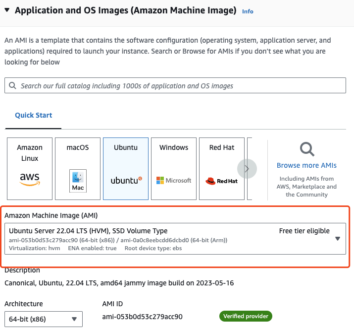
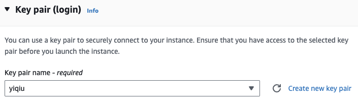
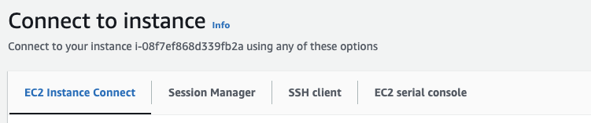
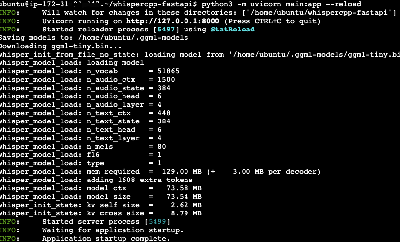
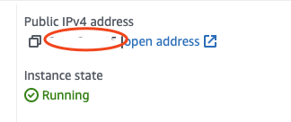
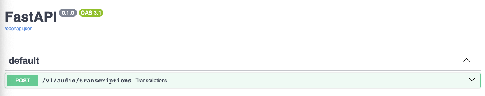
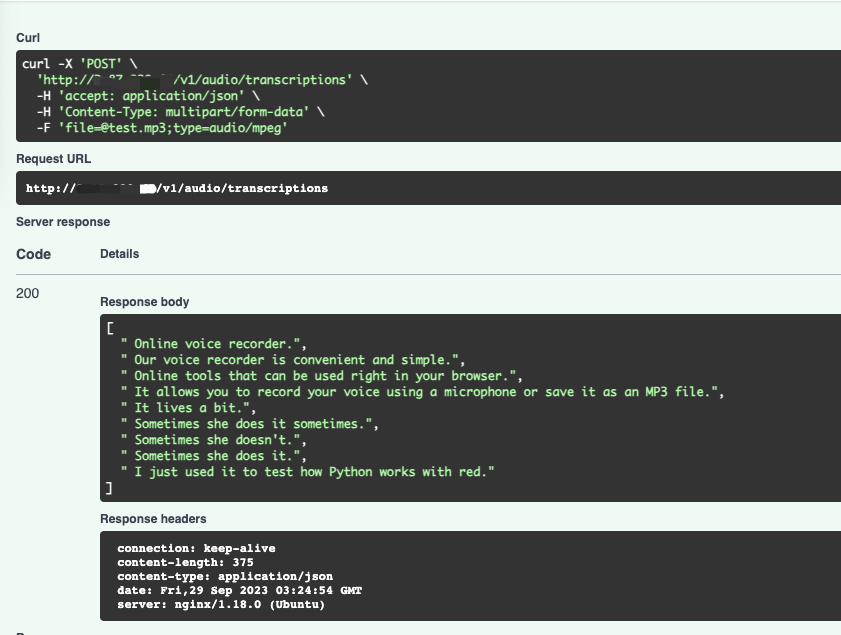

# Host whisper model for free (AWS free tier)
Step by step guide on how to host whisper model on aws free tier EC2 instance . 

We will use [Cython version](https://github.com/stlukey/whispercpp.py) of [whisper.cpp](https://github.com/ggerganov/whisper.cpp) so we could easily host it with fastapi.

In my case, I successfully host `tiny` and `base` on 1GB memory free tier EC2 ubuntu.  

# Step 1: Launch Ubuntu free EC2 instance on AWS
1. At AWS EC2 launch instance page, choose Ubuntu.


2. [optional] 
set up Key pair `.pem` file if you prefer ssh (recommended). Theoretically you don't need to SSH and modify code to make this project work. You can also directly connect to the console that EC2 provided.



3. Network setting
For easy testing purpose, now we just allow traffic from everywhere. 


4. Launch and connect to the instance. You can use SSH or AWS console.




# Step 2: Clone the Repo/Install Dependencies
In your ubuntu instance, clone this Repo:
```
git clone https://github.com/hyqshr/whispercpp-fastapi.git
```
Go to project folder:
```
cd whispercpp-fastapi
```
Install dependencies (whisper require `ffmpeg`): 
```
sudo apt update
sudo apt install python3-pip
sudo apt install ffmpeg
pip install -r requirements.txt
```
 In my case, the system will prompt for reboot, just hit enter.

We are getting close. Now all the dependencies are installed, let's test our API by:

```
python3 -m uvicorn main:app --reload
```

You should see something like this!



The `tiny` whisper model will be downloadded to `.cache`, it will only be downloadded once.

# Step 3: Nginx configuration
To enable other source to access our ubuntu instance, we need to configure Nginx.

```
sudo apt install nginx
```
By default, Nginx contains one server block called default. You can find it in this location: etc/nginx/sites-enabled.

Now at your root, run 
```
cd /etc/nginx/sites-enabled/
sudo vim fastapi_nginx
```

If you not sure how to use VIM, **Click i to enter insert mode**, then copy paste the following file:

!!!Note, you should change `server_name` to your instance `Public IPv4 address`.

```
server {
    listen 80;
    server_name 3.87.220.60;
    location / {
        proxy_pass http://127.0.0.1:8000;
    }
}
```




To save and quit vim, hit `esc` on keyboard,then type `:wq!` word by word, then hit `enter`.

Start Nginx server:
```
sudo service nginx restart
```
Then:
```
cd ~/whispercpp-fastapi
python3 -m uvicorn main:app --reload
```

Now visit you {public ipv4 address}/docs from your local browser, you should be able to see: 


We are able to communicate to our API now! Try out the Swagger provided by fastapi, and try submit a file to our whisper worker



You should protect your endpoint with SSL/auth/some other configuration.

# Last

Please leave a ⭐ if you like this tutorial.